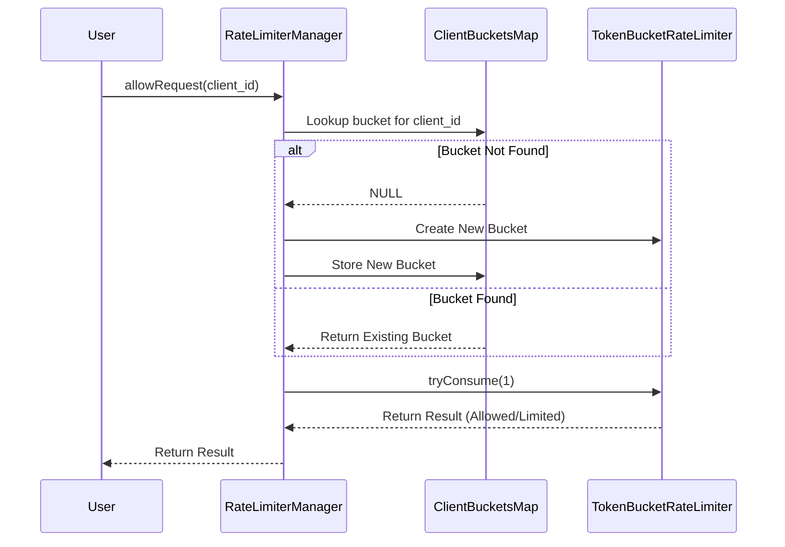
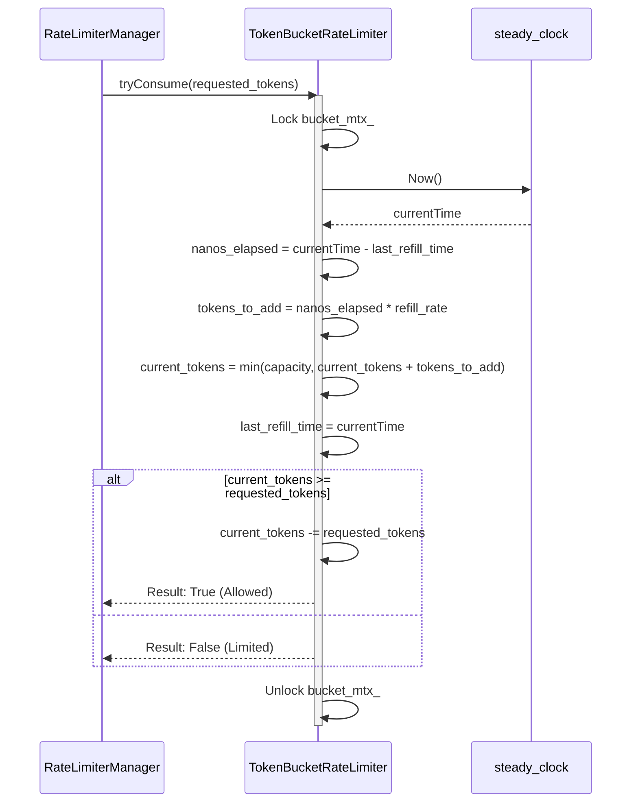

# C++ Token Bucket Rate Limiter

A high-performance, thread-safe, in-memory Token Bucket Rate Limiter implementation in C++. This program provides an API Gateway-style manager that can handle multiple clients concurrently with independent rate limits.

## Design Overview

The implementation follows the **Token Bucket Algorithm** with a **Lazy Refill** strategy to ensure high performance and low resource overhead.

### Core Components

1.  **`TokenBucketRateLimiter`**:
    *   Manages the state for a single client (bucket).
    *   **Capacity**: The maximum burst size allowed.
    *   **Refill Rate**: Tokens added per unit of time (calculated per nanosecond for high precision).
    *   **Lazy Refill**: Instead of using background threads to replenish buckets, tokens are calculated and added only when a request arrives. This reduces CPU usage and context switching.
    *   **Thread Safety**: Uses `std::mutex` and `std::lock_guard` to protect the bucket state during consumption and refill.

2.  **`RateLimiterManager`**:
    *   Manages a collection of buckets (one per `client_id`).
    *   **Independent Limits**: Each client gets its own bucket, ensuring "noisy neighbors" don't affect other users.
    *   **Fine-grained Locking**: Uses a two-stage locking strategy:
        1.  A global map lock is acquired briefly to find or create the client's bucket.
        2.  The bucket-specific lock is acquired during token consumption.
        This minimizes contention and allows different clients to be processed in parallel.

## Design Diagrams

### 1. High-Level Logic Flow

This diagram illustrates how the `RateLimiterManager` delegates the request to the appropriate `TokenBucketRateLimiter` based on the `client_id`.



### 2. Internal Token Consumption (Lazy Refill)

The `tryConsume` operation updates the bucket's state in an O(1) mathematical operation without needing background threads.



### Key Features

*   **Precision Engineering**: Uses `std::chrono::steady_clock` for accurate time delta calculations, immune to system clock adjustments.
*   **Scale Ready**: The lazy refill strategy and fine-grained locking make it suitable for high-throughput environments.
*   **Ease of Use**: Simple API (`allowRequest(client_id)`) that abstracts away the complexity of the underlying algorithm.

## Getting Started

### Prerequisites

*   A C++ compiler supporting C++20 (e.g., `g++` 10+).
*   `make` build utility.

### Build and Run

To compile and run the demonstration program:

```bash
make run
```

This will:
1. Compile `ratelim.cpp` into a binary named `ratelim`.
2. Execute the binary, showing a real-time simulation of requests hitting the rate limiter.

### Cleaning Up

To remove the compiled binary:

```bash
make clean
```

## Demonstration

The `main` function simulates a scenario where a user makes requests every 200ms with a capacity of 5 and a refill rate of 1 token per second. You will observe:
1. The first 5 requests are allowed immediately (burst capacity).
2. Subsequent requests are rate-limited until enough time has passed to "refill" the bucket.
3. Every 1 second, a new request is allowed.
